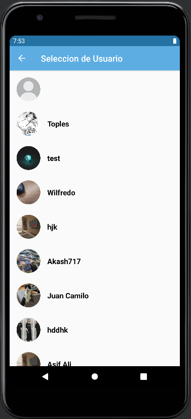
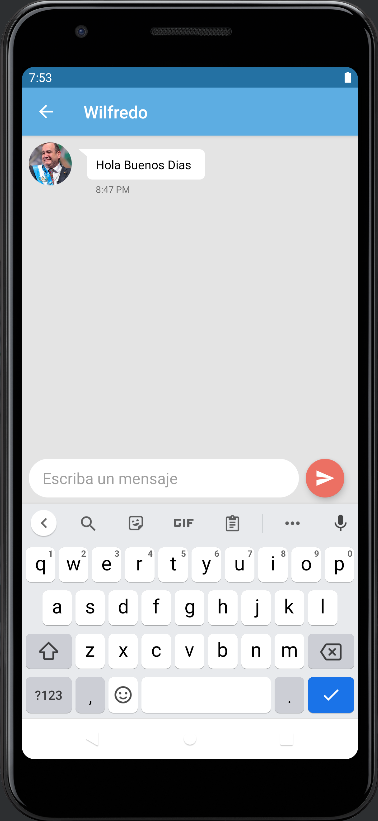
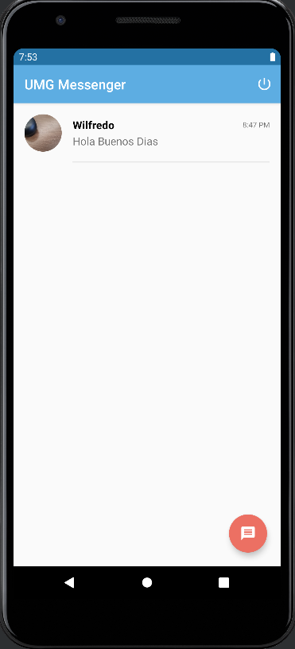
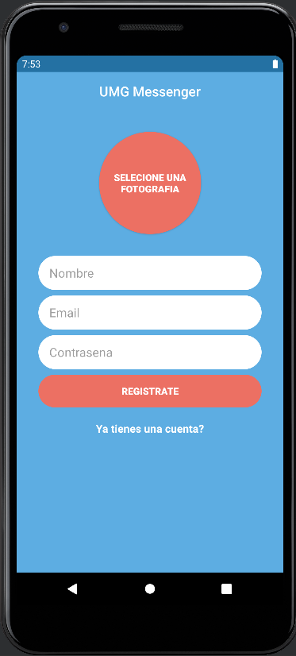
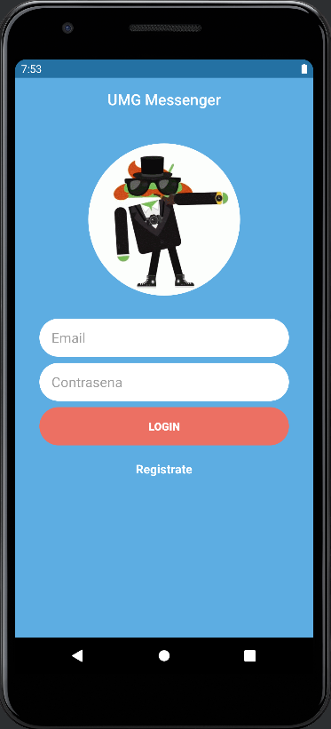

# UMG Messenger
Sistema de Mensajeria para Projecto de Programacion III UMG

## Screenshots

  
  
  
  
  

## Librerias Usadas:
1. [Firebase Authentication](https://firebase.google.com/docs/auth/)
2. [Firebase Realtime Database](https://firebase.google.com/docs/database/)
3. [Firebase Cloud Storage](https://firebase.google.com/docs/storage/)
4. [Glide](https://github.com/bumptech/glide/)
5. [Groupie](https://github.com/lisawray/groupie)
